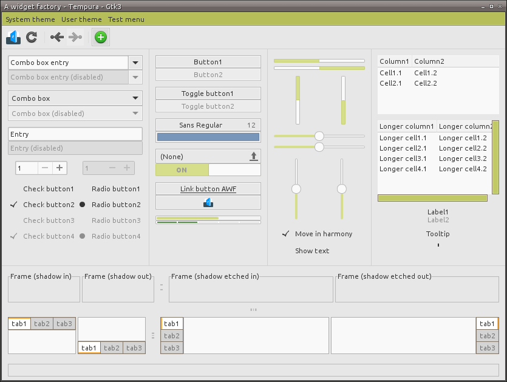

# Information
This is a port (and continuation) of the beautiful [Tempura](http://lokheed.deviantart.com/art/Tempura-Theme-32162210) theme by [lokheed](http://lokheed.deviantart.com/) to `gtk-3.x`.



# Installation

To install, create `~/.themes/` in your home directory:

```
mkdir ~/.themes
```

Then clone this repository to that location:

```
git clone https://github.com/hckr/tempura-theme-gtk3 ~/.themes/Tempura
```

# Credits
Tempura Theme originally by [lokheed](http://lokheed.deviantart.com/art/Tempura-Theme-32162210).
GTK3 theme based on [Numix Frost](https://github.com/Antergos/antergos-packages).

# License
[Creative Commons Attribution-ShareAlike 3.0 Unported License](license.html)
This is because the original work was released with that CC license.

